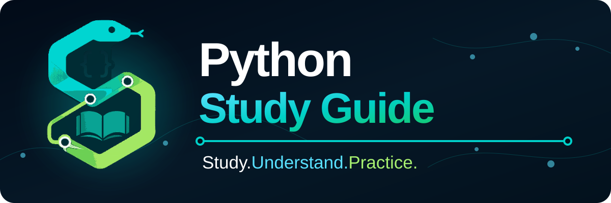

<div align="center">

# Guia de Estudos de Python 🐍

### Estude. Entenda. Pratique.



[🇺🇸 English](../../README.md) · [🇧🇷 Português](README.pt-BR.md) · [🇪🇸 Español](README.es.md)

</div>

Um guia prático e multilíngue para estudar Python, entender como suas partes se conectam e aplicar os conceitos por meio de exemplos claros.

Este projeto funciona ao mesmo tempo como trilha de aprendizagem e biblioteca de consulta rápida. Em vez de apresentar comandos isolados, cada tema explica o que um recurso faz, por que existe, quando utilizá-lo, quando evitá-lo e como ele trabalha com outras partes do Python.

## Por que o código está em inglês?

Os nomes de pastas, arquivos, variáveis, funções, classes e outros identificadores são escritos em inglês. Isso ajuda quem está aprendendo a se familiarizar com convenções encontradas em bibliotecas, documentações técnicas e projetos internacionais.

As explicações estão disponíveis em inglês, português brasileiro e espanhol.

## Como estudar

Cada capítulo segue uma estrutura consistente:

1. O que é
2. Por que existe
3. Sintaxe e convenções
4. Quando utilizar
5. Quando evitar
6. Como se conecta a outros recursos
7. Exemplos básicos e práticos
8. Erros comuns
9. Exercício
10. Checklist de revisão
11. Resumo para consulta rápida

## Roadmap de aprendizagem

O guia cresce dos fundamentos do Python até funções, documentação, tratamento de erros, arquivos, biblioteca padrão, bibliotecas externas, testes e projetos práticos.

- [Trilha completa de estudos: links diretos para todos os capítulos publicados](../learning-path.pt-BR.md)
- [Roadmap em Português](../roadmap.pt-BR.md)
- [Roadmap in English](../roadmap.en.md)
- [Roadmap en Español](../roadmap.es.md)

## Estrutura do projeto

```text
python-study-guide/
├── assets/
├── comments-and-documentation/
├── collections/
├── docs/
├── exercises/
├── external-libraries/
├── functions/
├── fundamentals/
├── practical-projects/
├── program-flow/
├── scripts/
├── standard-library/
├── strings-and-numbers/
└── tests/
```

Explicações detalhadas:

- [Estrutura do projeto em Português](../project-structure.pt-BR.md)
- [Project structure in English](../project-structure.en.md)
- [Estructura del proyecto en Español](../project-structure.es.md)

## Status atual

A fundação do projeto está concluída. A Fase 0 estabeleceu a documentação multilíngue, o fluxo de contribuição, os templates de colaboração, os padrões da comunidade, a autoria, a licença, a governança de IA, as validações automáticas, a identidade visual original, a estrutura escalável e a auditoria final da fundação.

A fundação do projeto e quatro seções educacionais completas estão disponíveis. A [Fase 1: Fundamentos](../../fundamentals/README.pt-BR.md) agora oferece seis capítulos revisados para iniciantes. A Fase 6 reúne seis capítulos de aprendizagem revisados:

- [Comentários em Python](../../comments-and-documentation/01-comments/README.pt-BR.md)
- [Docstrings em Python](../../comments-and-documentation/02-docstrings/README.pt-BR.md)
- [Nomes Significativos e Código Autoexplicativo](../../comments-and-documentation/03-meaningful-names/README.pt-BR.md)
- [Marcadores de Tarefas e Acompanhamento Técnico](../../comments-and-documentation/04-task-markers/README.pt-BR.md)
- [Comentários versus Logging em Python](../../comments-and-documentation/05-comments-vs-logging/README.pt-BR.md)
- [PEP 8 e Legibilidade em Python](../../comments-and-documentation/06-pep8-and-readability/README.pt-BR.md)

As Fases 1, 2, 3 e 6 estão concluídas. A Fase 4 está em andamento com quatro capítulos revisados: [Condições, Comparações e Lógica Booleana](../../program-flow/01-conditions-comparisons-and-boolean-logic/README.pt-BR.md) constrói condições confiáveis, [`if`, `elif` e `else`](../../program-flow/02-if-elif-and-else/README.pt-BR.md) usa essas condições para ramificações condicionais, [`match` e `case`: Correspondência de Padrões Estruturais](../../program-flow/03-match-and-case/README.pt-BR.md) adiciona seleção por padrões e [Loops `for` e Iteração](../../program-flow/04-for-loops-and-iteration/README.pt-BR.md) introduz repetição item por item sobre iteráveis. A Fase 3 reúne seis capítulos revisados de Coleções, encerrando com [Escolhendo a Coleção Certa](../../collections/06-choosing-the-right-collection/README.pt-BR.md). A Fase 2 permanece concluída com quatro capítulos revisados, encerrando com [Funções Numéricas Embutidas](../../strings-and-numbers/04-numeric-builtins/README.pt-BR.md). Consulte o [roadmap](../roadmap.pt-BR.md) ou a [trilha completa de estudos](../learning-path.pt-BR.md) para acompanhar o status do currículo e acessar os capítulos diretamente.

## Identidade visual

O símbolo do projeto conecta Python, código, aprendizagem e relações entre conceitos por meio de uma serpente geométrica, chaves, um livro aberto e nós conectados.

Consulte o [guia da identidade visual](../../assets/README.md) para conhecer os arquivos, a paleta, os significados, as orientações de acessibilidade e as regras de uso.

## Desenvolvimento assistido por IA

Este projeto utiliza ferramentas de inteligência artificial, incluindo ChatGPT e Codex, para apoiar planejamento, pesquisa, elaboração de textos, tradução, revisão e manutenção do repositório.

O conteúdo produzido por IA não é aceito automaticamente. Toda alteração deve ser compreendida, verificada e revisada pelo mantenedor antes de ser incorporada à branch `main`.

As instruções gerais estão registradas em [AGENTS.md](../../AGENTS.md). Leia o [guia de desenvolvimento assistido por IA](../ai-assisted-development/README.pt-BR.md) para conhecer o fluxo responsável.

## Autoria e manutenção

O Python Study Guide foi criado e é mantido por [Ramon Estevez Rodriguez](https://github.com/RamonRDR).

As contribuições permanecem creditadas nos metadados dos commits, no histórico do Git e nos pull requests. Consulte o [registro de autoria do projeto](AUTHORS.pt-BR.md).

## Comunidade e suporte

A participação segue o [Código de Conduta](CODE_OF_CONDUCT.pt-BR.md). O [Guia de Suporte](SUPPORT.pt-BR.md) explica qual canal utilizar. Possíveis vulnerabilidades devem seguir o processo privado da [Política de Segurança](SECURITY.pt-BR.md).

## Como contribuir

Contribuições, correções, exemplos e melhorias de tradução são bem-vindos. Leia o [guia de contribuição em português](CONTRIBUTING.pt-BR.md) antes de abrir um pull request. As versões em [inglês](../../CONTRIBUTING.md) e [espanhol](CONTRIBUTING.es.md) também estão disponíveis.

## Licença

Este projeto está disponível sob a [Licença MIT](../../LICENSE).
